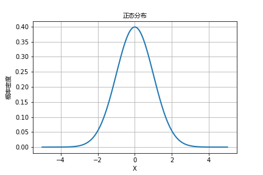

# 揭秘人生之谜：为何我们需要掌握“内视”的力量？

本章概念：内视

*这一章的内容来源于李笑来在相约七年后专题里，2021-08的视频分享：内视*

---

## 什么是内视？

有时我们会发现，有些人看着我们的时候，我们会感觉他的目光仿佛能透视过我们，看到更远的地方。我们称这种眼神为深邃，但在本质上，这是内视能力的外在体现。

人可以分为两类：大多数人是以外视的方式思考，而另一部分人则是以内视的方式思考。曾子曰：*“吾日三省吾身。”* 他主张每天都要自我反思，而且不只一次，而是三次。这种自我反思就是我们现在所谈论的内视。

那么为何要用 **“内视"** 而不是 **“自省”** 呢？很多人误认为自省就是反省，只有在做错事情后才需要进行。实际上，这里的自省更贴切地理解应该是内视。

**内视**，代表着的是一种**超越外在世界、深入洞察内在世界**的能力。

---

## 主观和客观

外视和内视是两种截然不同的思考方式。外视是我们的思考主要集中在周遭事物的变化上，而内视则是我们的思考主要集中在内心的思维活动上。

尼采曾说：*“世上没有事实, 只有对事实的诠释。”* 尼采是个天才，能够通过自身对世界的理解，总结出这个道理。尽管在他的时代，脑科学并未发达到能证实他的这种看法，但我们无法否认这个观点的深刻影响。

我们经常说我们要客观地看待问题。但是，什么是客观呢？客观的对立面，主观又是什么？我们真的能做到客观吗？

世界是客观存在的，但世界的客观存在并不意味着我们对世界的理解也必然是客观的。比如我们看到的颜色，听到的声音，其实只是不同的频率——颜色是光的频率，声音是空气振动的频率。而我们所认为的颜色实际上是我们的大脑把这些信息过滤成一个方便我们感知的世界。

我们感知到的世界并不是客观的，而是主观的。这个分析推导出了一个结论：

> **我们的天性是主观的**

而客观是一种能力，一种看待事物更真实的视角的能力，而这种客观的能力是可以通过学习来提升的。

客观的能力实际上是一种综合能力，比如知识的学习就能让我们更加客观，有一门知识对于我们培养客观能力有着巨大的帮助：***概率论***。

---

## 正态分布的启示

有一个著名的实验可以很好地解释这一点：大多数人都认为自己的驾驶技术高于平均水平，但从统计学的角度来看，这显然是不可能的。这就说明他们对自己的驾驶技术并没有一个客观的理解。

这也意味着我们无法控制我们要不要客观，因为我们的主观性是与生俱来的。但这又对我们有什么启示呢？

以自动驾驶技术为例，有些人在讨论自动驾驶是不是比人类驾驶更好的时候，他们往往忽略了这一点，认为自己的驾驶技术是上乘的，而忽视了自己实际的驾驶水平。要做到客观，我们需要审视自己相对于他人的位置。这其实就是内视能力最基础的一种体现。

正态分布是一种揭示我们社会现象的重要工具。我们可以将它简单地划分为三类。观察社会现象，我们会发现大多数事物两极化都很少，大部分都是处在中间。例如，富人和穷人处在正态分布的两端，大多数人都处在靠近中间的区域。智商，教育程度，驾驶技术，等等。

这说明大多数人的各项能力或状态都比较接近，只有少部分的人特别突出。我们自身就处在其中的一类，对于其他两类的人，我们其实是很难想象他们和我们的区别有多大。

有句话说，贫穷限制了想象，这是正确的。但除此之外，我们也难以想象贫穷，也难以想象富人过的是什么样的生活。我们可以依据自己的认知去想象其他两极的生活，但那只是我们的主观理解，并不是客观的事实。认知的差异决定了我们对世界的客观认知程度。

基于以上的深入分析，我们已经有了一个明确的认识：

> **要达到更高的客观性，我们必须消除认知差异。**

以富人和穷人为例，我们可以通过观察他们的生活方式来尽可能客观地评估他们的生活情况。

然而，对于外部世界的事物，我们可以借助各种方法来实现客观性。那么，对于内在的事物呢？

例如，一个人的能力高低，对概念的理解程度，手艺的熟练程度，或者是更个人化的事情，如价值观，选择，我们所追求的生活方式，我们想要完成的事情等等。我们如何能对这些事物保持客观呢？与外部事物不同，我们很难找到对应的参照物来比较。没有对比，我们就无法通过上述方法提高客观性。

这正是本文的核心概念：**“内视”**。由于外部世界没有对应的参照物，我们只能向内寻找比较标准，只能与自己比较，看看哪种选择，哪种价值观对我们更有价值，对我们更有用。我们真正想要的生活是什么样的？我们想要完成的事情是否真的有价值？这些事情对别人，对我们自己是否有意义？

---

## 内视对于反应模式/性格的影响

内视的人通常更专注于自身，因为他们需要思考的重要问题很多，只有依靠自己才能找到答案。他们的心中也存在一个类似正态分布的图像，他们的进步越大，他们就越倾向于右侧，可以认知的维度也会变得更广，思考就会更加客观。

我们有时会有这样的感悟：

> *一开始，看山是山；后来，看山不是山；再后来，看山还是山。*

这是一种境界的提升，尽管最后的结论竟然是一样的，但它带来的理解和变化却大相径庭。

最终，我们会发现内视的人都有一个共同的特点，那就是他们都有一个长期值得投入的事情，并且他们非常地专注在这件事情上面。因此，他们必须变成内视的人，因为他们的成长不能仅仅依赖外界的建议，也因为他们深知这件事情对自己非常重要，所以他们都把注意力放在了上面。也因此，他们只剩下少许的注意力可以用来关注外界。

内视的好处是它使我们的行为和思考越来越客观，这也意味着我们的行为和思考越来越正确。

当我们养成了内视的习惯，如果出现了问题，我们通常会首先从自身找问题。我们能在哪里做得更好？下一次如何避免类似的问题再次发生？我们不会立即把责任推到别人身上。

多数时候，我们会发现，其实我们可以做得更好。虽然我们不能控制结果，坏事总会发生，这是我们做出选择的后果。如果我们最终发现这个选择的弊大于利，那我们就可以做出改变。如果这个选择仍然是最优的，那我们也只能接受并承担发生意外的风险和成本。

这种认知方式，使得内视的人最终会变得更平和。这种平和来源于两个思维方面：

> * *在还没有把事情想清楚，理清楚时，争论是无法解决问题的，所以就干脆不争论了。争论只是浪费时间和精力。如果连真正的问题都没理清楚，花时间讨论解决方案到底是想干嘛？*
>
> * *当我们真正理解并明白问题后，还有必要争论吗？为什么还要浪费时间去纠结谁对谁错呢？为什么不快点解决这个问题呢？*

当我们越来越平和，我们就越容易内视，也就越容易客观地看待问题，以及分析问题的本质。他们会用长远的眼光看待事情，尽可能地用正确的方法做正确的事情。他们的长期能力也会越来越高。

**“长期”** 是一个我们经常提到的重要且正确的概念，与许多其他概念，如[领导力](https://github.com/ericlee1778/writing/blob/main/chinese/%E7%AC%94%E8%AE%B0%20-%20%E7%9B%B8%E7%BA%A6%E4%B8%83%E5%B9%B4%E5%90%8E%20(%E8%A7%86%E9%A2%91%E8%AF%BE%E7%A8%8B%E6%9D%A5%E6%BA%90%E4%BA%8E%E6%9D%8E%E7%AC%91%E6%9D%A5%E8%80%81%E5%B8%88)/006.%E9%A2%86%E5%AF%BC%E5%8A%9B.md)，[手艺](https://github.com/ericlee1778/writing/blob/main/chinese/%E7%AC%94%E8%AE%B0%20-%20%E7%9B%B8%E7%BA%A6%E4%B8%83%E5%B9%B4%E5%90%8E%20(%E8%A7%86%E9%A2%91%E8%AF%BE%E7%A8%8B%E6%9D%A5%E6%BA%90%E4%BA%8E%E6%9D%8E%E7%AC%91%E6%9D%A5%E8%80%81%E5%B8%88)/012.%E6%89%8B%E8%89%BA.md)等都有关联。可以说，每一个正确的概念都与长期有关。我们可以思考一下，内视一下，是否真是如此。

一些看似与长期和内视无关的概念实际上有着紧密的关系。比如，[不装](https://github.com/ericlee1778/writing/blob/main/chinese/%E7%AC%94%E8%AE%B0%20-%20%E7%9B%B8%E7%BA%A6%E4%B8%83%E5%B9%B4%E5%90%8E%20(%E8%A7%86%E9%A2%91%E8%AF%BE%E7%A8%8B%E6%9D%A5%E6%BA%90%E4%BA%8E%E6%9D%8E%E7%AC%91%E6%9D%A5%E8%80%81%E5%B8%88)/001.%E4%B8%8D%E8%A3%85.md)，从长期来看，是更划算的，因为我们可以将更多的注意力和精力放在自我成长上。[原则](https://github.com/ericlee1778/writing/blob/main/chinese/%E7%AC%94%E8%AE%B0%20-%20%E7%9B%B8%E7%BA%A6%E4%B8%83%E5%B9%B4%E5%90%8E%20(%E8%A7%86%E9%A2%91%E8%AF%BE%E7%A8%8B%E6%9D%A5%E6%BA%90%E4%BA%8E%E6%9D%8E%E7%AC%91%E6%9D%A5%E8%80%81%E5%B8%88)/004.%E5%8E%9F%E5%88%99.md)，对于长期的事情，我们应该用原则而不是计划来指导我们的行为和思考。[不信邪](https://github.com/ericlee1778/writing/blob/main/chinese/%E7%AC%94%E8%AE%B0%20-%20%E7%9B%B8%E7%BA%A6%E4%B8%83%E5%B9%B4%E5%90%8E%20(%E8%A7%86%E9%A2%91%E8%AF%BE%E7%A8%8B%E6%9D%A5%E6%BA%90%E4%BA%8E%E6%9D%8E%E7%AC%91%E6%9D%A5%E8%80%81%E5%B8%88)/003.%E4%B8%8D%E4%BF%A1%E9%82%AA.md)，因为科技的进步使我们的寿命不断延长，所以从长期来看，做好人总是比做坏人更划算，并且会越来越划算。

具备了内视的能力，我们可以客观地审视自己对于这些概念的理解和应用，从而改变我们的反应模式（也就是大多数人俗称的性格）。良好的反应模式帮助我们做出更好的判断，做出更优的选择，最终形成更好、更有用的价值观和做事原则。而从长期来看，好的反应模式最终会改变我们的命运。
