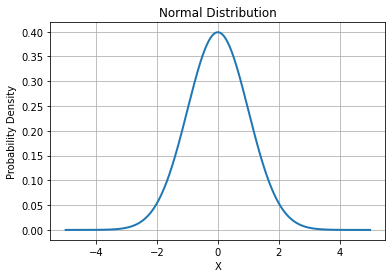

# Unveiling the Mystery of Life: Why Do We Need to Master the Power of "Introspection"?

Concept of this chapter: Introspection

*The content of this chapter comes from Li Xiaolai's video sharing in 2021-07 on the topic "Introspection" in the series "See You in Seven Years".*

---

## What is Introspection?

Sometimes, we find that when some people look at us, we feel as if their gaze can see through us, reaching further. We call such a gaze profound, but essentially, this is an outward manifestation of the power of introspection.

People can be divided into two types: most people think in an extrospective way, while others think introspectively. Chinese philosopher and student of Confucius, ZengZi once said: *"I reflect upon myself three times a day."* He advocated self-reflection, not just once, but three times a day. This self-reflection is the introspection we are discussing now.

So why use **"introspection"** instead of **"self-reflection"**? Many people mistakenly believe that self-reflection is repentance, only needed when they do something wrong. In fact, self-reflection should more accurately be understood as introspection. 

**Introspection** signifies an ability to **transcend the external world and deeply perceive the inner world**.

---

## Subjectivity and Objectivity

Extrospection and introspection are two entirely different ways of thinking. Extrospection refers to our thoughts primarily focused on the changes in things around us, while introspection implies that our thoughts are primarily focused on the activities in our mind.

Nietzsche once said: *"Everything is interpretation."* Nietzsche was a genius who could sum up this truth through his understanding of the world. Although brain science was not developed enough to confirm his view during his time, we cannot deny the profound impact of this viewpoint.

We often say we need to look at issues objectively. But what is objectivity? And what is the opposite of objectivity, subjectivity? Can we truly be objective?

The world exists objectively, but this does not mean that our understanding of the world must also be objective. For instance, the colors we see, the sounds we hear, are actually just different frequencies — color is the frequency of light, sound is the frequency of air vibration. The colors we perceive are actually our brain filtering this information into a world that is easy for us to perceive.

The world we perceive is not objective, but subjective. This analysis leads to a conclusion:

> **Our nature is subjective**

Objectivity is a capability, the ability to look at things from a more realistic perspective, and this objective capability can be enhanced through learning.

The ability to be objective is actually a comprehensive skill. For instance, learning knowledge can make us more objective. One particular subject has a significant impact on our development of objectivity: ***Probability Theory***.

---

## Lessons from Normal Distribution

A famous experiment illustrates this well: most people believe their driving skills are above average, but from a statistical standpoint, this is clearly impossible. This indicates that they do not have an objective understanding of their driving skills.

This also means we cannot control whether we want to be objective, as our nature is subjective. But what does this mean for us?

Take the case of autonomous driving technology. When some people discuss whether autonomous driving is better than human driving, they often overlook this point, assuming their driving skills are superior and disregarding their actual level of driving. To be objective, we need to look at our position relative to others. This is a basic manifestation of the ability of introspection.

The normal distribution is a critical tool in revealing our social phenomena. We can simply divide it into three categories. Observing social phenomena, we find that most things are seldom polarized and are mostly in the middle. For instance, the rich and the poor are at the extremes of the normal distribution, with most people in the near-middle area. This applies to IQ, level of education, driving skills, and so on.

This shows that the capabilities or statuses of most people are relatively close, with only a small number of people standing out. We are one of the categories, and it is challenging for us to imagine how big the differences are between us and the people in the other two categories.

There's a saying that poverty limits imagination, and this is true. But besides this, it's hard for us to imagine poverty or what life is like for the wealthy. We can imagine the lives of the other extremes based on our knowledge, but that's our subjective understanding, not an objective fact. The difference in cognition determines our degree of objective understanding of the world.

Based on the in-depth reasoning above, we now have a clear understanding:

> **To achieve higher objectivity, we must eliminate cognitive differences.**

Taking the rich and the poor as examples, we can objectively evaluate their living conditions as much as possible by observing their lifestyles.

However, for external matters, we can adopt various methods to achieve objectivity for external things. But what about internal matters?

For instance, one's level of ability, understanding of concepts, proficiency in skills, or more personalized things like values, choices, the lifestyle we pursue, the things we want to accomplish, etc. How can we stay objective about these things? Unlike external things, we can hardly find a reference to compare with. Without comparison, we can't improve objectivity through the above method.

This brings us to the core concept of this chapter: **"introspection"**. Since there is no corresponding reference in the external world, we can only seek standards for comparison within, compare only with ourselves, and see which choice, which set of values, is more valuable and useful to us. What kind of life do we really want? Are the things we want to accomplish truly valuable? Are these things meaningful to others, and to ourselves?

---

## The Impact of Introspection on Response Patterns/Personality

Those who practice introspection tend to be more self-focused, as they are often dealing with important questions that only they can answer. They carry in their minds an image akin to a normal distribution; the more they progress, the more they tend to lean towards the right side, and the dimensions of their cognition broaden, making their thinking more objective.

There's a realization we sometimes come to:

> *At first, we see a mountain as a mountain; then, we see a mountain as not a mountain; and finally, we see a mountain once again as a mountain.*

This represents an elevation of consciousness. Even though the ultimate conclusion seems the same, the understanding and transformation it brings are fundamentally different.

In the end, we find that introspective individuals share a common trait: they all have a long-term pursuit to which they devote their attention and focus. Therefore, they need to become introspective, because their growth cannot solely rely on external advice and they deeply understand the importance of this pursuit, hence their concentration on it. As a result, they have little attention left to dedicate to the outside world.

The advantage of introspection is that it makes our behavior and thinking increasingly objective, which means our actions and thoughts are becoming increasingly correct.

Once we develop the habit of introspection, when problems arise, we tend to first look inward. Where can we do better? How can we prevent similar issues from happening next time? We don't immediately shift the blame to others.

Most of the time, we discover that indeed we could have done better. Although we can't control the outcome and bad things will inevitably happen, these are consequences of our choices. If we find the drawbacks of a choice outweigh its benefits, we can make changes. If the choice remains optimal, we must accept and bear the risks and costs associated with unforeseen circumstances.

This way of thinking leads introspective people to a greater sense of calm. This calm derives from two aspects of thinking:

> * *Arguing does not solve problems when we haven't clearly thought through or understood them, so it's better not to argue. Arguing only wastes time and energy. What's the point of discussing solutions when the actual problem hasn't been clarified?*
>
> * *Once we truly understand and comprehend a problem, is there any need to argue? Why waste time fussing over who's right and who's wrong? Why not quickly resolve the issue?*

As we become more calm, we find it easier to introspect, which in turn makes it easier to objectively view and analyze the core problems. Introspective individuals tend to look at things with a long-term perspective, striving to do the right things in the correct way. Their long-term abilities improve over time.

**"Long-term"** is an important and accurate concept we often mention, linked with many other concepts like [Leadership](https://github.com/ericlee1778/writing/blob/main/english/Learning%20Note%20-%20See%20You%20in%20Seven%20Years%20series%20(from%20Li%20Xiaolai)/006.Leadership.md), [Craftsmanship](https://github.com/ericlee1778/writing/blob/main/english/Learning%20Note%20-%20See%20You%20in%20Seven%20Years%20series%20(from%20Li%20Xiaolai)/012.Craftsmanship.md), etc. It could be said that every correct concept has something to do with the long-term. We can ponder, introspect, to see if this is indeed the case.

Some concepts that seem unrelated to long-term and introspection are, in fact, closely connected. For example, [Being Genuine](https://github.com/ericlee1778/writing/blob/main/english/Learning%20Note%20-%20See%20You%20in%20Seven%20Years%20series%20(from%20Li%20Xiaolai)/001.Being%20Genuine.md) is more beneficial in the long run, as it allows us to dedicate more attention and energy to self-improvement. For long-term matters, we should use [Principles](https://github.com/ericlee1778/writing/blob/main/english/Learning%20Note%20-%20See%20You%20in%20Seven%20Years%20series%20(from%20Li%20Xiaolai)/004.Principles.md) to guide our behavior and thinking rather than plans. [Not Believing in the Evil](https://github.com/ericlee1778/writing/blob/main/english/Learning%20Note%20-%20See%20You%20in%20Seven%20Years%20series%20(from%20Li%20Xiaolai)/003.Not%20Believing%20in%20the%20Evil.md), with the advancement of technology extending our lifespans, being good is more beneficial than being bad in the long run, and it will become increasingly so.

Equipped with the ability to introspect, we can objectively evaluate our understanding and application of these concepts, thereby altering our response patterns (commonly referred to as personality by most people). Good response patterns assist us in making better judgments, optimal choices, and ultimately forming better, more useful values and principles for action. In the long run, these good respond patterns will ultimately change our destiny.
